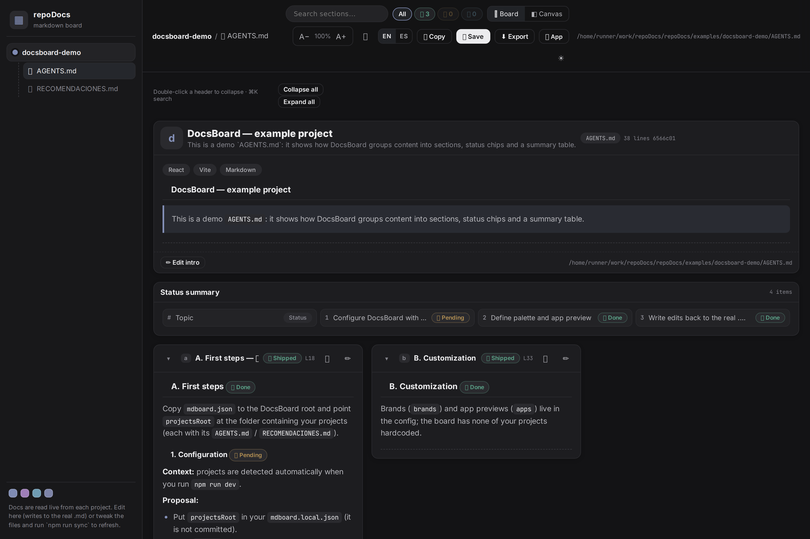
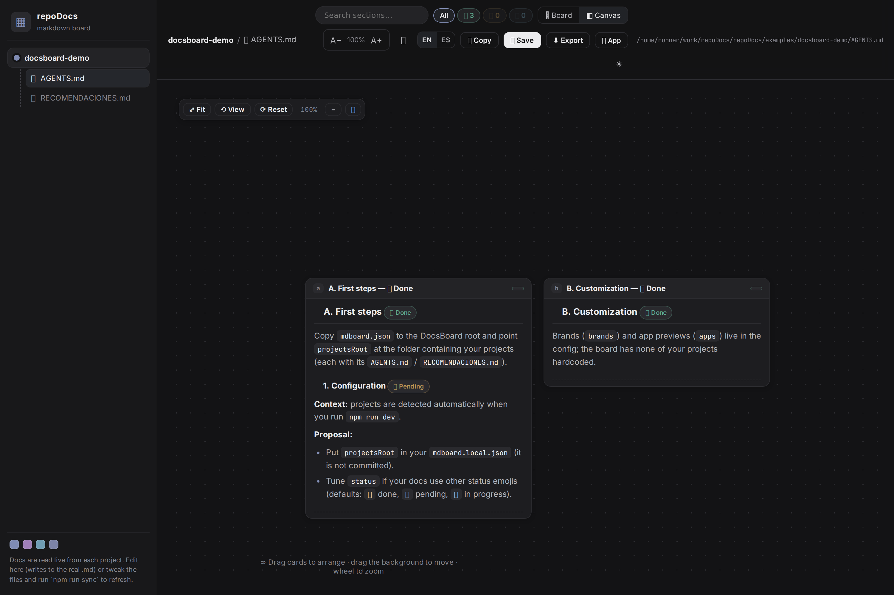
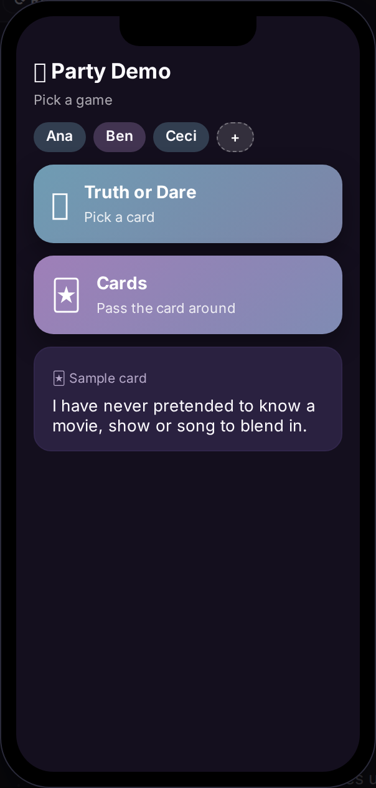
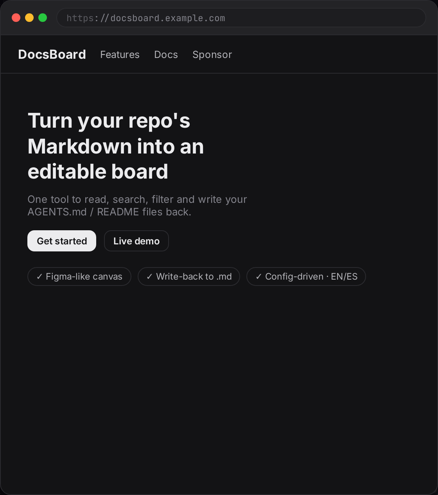

# repoDocs

Turn a folder of Markdown docs (one per repo) into a **Figma-like board** — read, search,
filter by status, edit every section, and write changes straight back to the real `.md` files.



## Preview

| Canvas view | Mobile app preview | Web app preview |
| ----------- | ------------------ | --------------- |
|  |  |  |

## Why

`AGENTS.md` / `README.md` files are the single source of truth for a project, but
reading them inside the repo you're coding in is a poor experience. repoDocs reads any folder
with `.md` files, turns modern documents into cards on a board (or a canvas), and lets you:

- **Read** long docs as separate, collapsible sections.
- **Search** and **filter by status** (✅ done · 📌 pending · 🔶 in progress — labels configurable
  globally, per project, per document, or in a document's frontmatter).
- **Edit** any section in place with live Markdown preview and a **formatting toolbar** (no Markdown
  knowledge required).
- **Export / write back** the full Markdown to the original `.md` files.
- **Preview** a phone-style mock **and/or a desktop web mock** of your project (config-driven, optional).
- **Smooth UX**: keyboard shortcuts (`Ctrl/⌘+K`, `B`/`C`, `E`), per-section undo and undo on reset,
  collapse all / expand all, clickable status chips, a first-run **onboarding tour**, and a
  distraction-free **focus/reading mode**. UI is bilingual (EN/ES).

## Quick start

```bash
npm install
npm run dev        # scans ./examples → http://localhost:5173
```

It works out of the box with the demo docs in `examples/`. Point it at your own repos:

```bash
cp mdboard.json mdboard.local.json   # then edit (mdboard.local.json is gitignored)
```

```jsonc
{
  "projectsRoot": "../my-projects-folder", // each subfolder with its .md files
  "status": [
    { "key": "done", "emoji": "✅", "label": "Completada", "plural": "Completadas", "hint": "completad|listo" },
    { "key": "pending", "emoji": "📌", "label": "Pendiente", "plural": "Pendientes", "hint": "pendiente|falta" },
    { "key": "progress", "emoji": "🔶", "label": "En progreso", "plural": "En progreso", "hint": "en progreso|validad" }
  ],
  "brands": {
    "my-projects-folder": { "accent": "#7c5df8", "palette": ["#7c5df8", "#f59e0b"], "stack": ["React Native", "Expo"],
      "status": { "progress": { "label": "En desarrollo", "plural": "En desarrollo" } }, // per-project label override
      "docs": { "AGENTS.md": { "status": { "pending": { "label": "Backlog", "plural": "Backlog" } } } } // per-document override
    }
  },
  "apps": [ // optional: phone-style previews; empty = hide the 📱 button
    { "forProject": "my-projects-folder", "name": "My App", "screen": { "kind": "party", "title": "🍾 My App" } }
  ],
  "websites": [ // optional: desktop web-style previews (shown next to the app mock)
    { "forProject": "my-projects-folder", "name": "My Site", "url": "mysite.example.com",
      "screen": { "kind": "landing", "nav": ["Features", "Docs"], "hero": "My site hero",
                  "cta": "Get started", "points": ["One", "Two"] } }
  ]
}
```

Status labels cascade per document: global `status[]` → `brands.<project>.status` →
`brands.<project>.docs.<file>.status` → frontmatter. The final labels are emitted per document and
shown on the chips (e.g. *Shipped* instead of *Done*).

`mdboard.json` holds the public defaults (commit it). Put everything local/private in
`mdboard.local.json` (already gitignored).

## Editing workflow

- Edits always land in the browser first (`localStorage`, key `pb:edits`).
- When served by a Vite server (dev/preview), **saving a section writes it back to the real `.md`**
  (`POST /__mdboard/write` middleware) — and the **💾 Save** button in the top bar writes the whole
  document. Set `MDBOARD_NO_WRITE=1` (or run outside Vite) to keep edits local-only.
- **Export / Copy** rebuilds the full Markdown with your changes applied, for manual pasting.
- **↺ Reset** discards all local edits (never touches files).

## ADR Premium (Decisions)

Architecture Decision Records in any project's `docs/adr/` (or the folders in `mdboard.json` →
`adr.paths`) become a **🧭 Decisions** tab (topbar toggle or `D`):

- **Parser** (`scripts/sync-adr.mjs`) reads front-matter in **YAML** (`---`), **JSON** (`;;;`) or
  **TOML** (`+++`), plus plain-text heuristics: canonical ids (`0007 → 7`), H2 sections with line
  ranges, `status`/`date`/`deciders`, and relations (`supersedes`, `superseded_by`,
  `related_to`, `depends_on`) — validated by `npm run adr:lint`.
- **Card list** with status, relation badges and supersession alerts, and **export to Mermaid**
  (`.mmd`) for READMEs/PRs.
- **Relations graph** as a full-width SVG canvas (drag, pan/zoom, focus mode).
- **License**: free = up to 10 ADRs per project; premium unlocks the graph and unlimited ADRs with
  an **Ed25519**-signed token (offline validation, no telemetry). The issuing webhook
  (Gumroad / Lemon Squeezy) lives in `server/` — see `server/README.md`.

## Scripts

| Command            | Description                                                        |
| ------------------ | ------------------------------------------------------------------ |
| `npm run sync`     | Rescan `projectsRoot`, regenerate `src/generated/{docs,appconfig}.ts` and `adr.ts` |
| `npm run adr:lint` | Check ADR relations / missing Context sections (exit code ≠ 0 if broken) |
| `npm run webhook:local` | Run the license issuing webhook on `:8787` |
| `npm run dev`      | Vite dev server (runs sync first)                                  |
| `npm run build`    | `tsc -b && vite build` (runs sync first)                           |
| `npm run lint`     | oxlint                                                             |
| `npm run smoke`    | E2E smoke test (spawns its own preview on :5199, writes disabled)  |
| `npm test`         | Unit tests: ADR parser (YAML/JSON/TOML), license, webhook, Mermaid, config |

## How it works

- `scripts/sync-docs.mjs` parses each `.md` into sections (H1/H2 blocks), detects **status**
  from the config emojis and the **summary table** (kept as a special `summary` section that is
  regenerated on export rather than edited).
- Edits are stored **per line range** (`src/lib/registry.ts` `assembleRaw()`), so separators and
  ordering are preserved and the exported Markdown is byte-identical when nothing is edited.
- `src/generated/` is auto-generated and **gitignored** — it never commits your private docs.

## Sponsor

repoDocs is free and MIT-licensed. If it saves your team time, a small recurring contribution
directly funds the [`funded`](https://github.com/alecerca/repoDocs/labels/funded) roadmap items
([GitHub integration](https://github.com/alecerca/repoDocs/issues/4),
[canvas export](https://github.com/alecerca/repoDocs/issues/5),
[plugin system](https://github.com/alecerca/repoDocs/issues/6)).

| Tier          | Price   | What you get                                                     |
| ------------- | ------- | ---------------------------------------------------------------- |
| ☕ **Coffee**   | $3/mo   | Vote on roadmap priorities                                       |
| 🚀 **Supporter** | $8/mo   | Prioritized issue requests                                       |
| 🏢 **Studio**   | $20/mo  | Office/team support and onboarding                               |

[](https://github.com/sponsors/alecerca)
See [SPONSORING.md](SPONSORING.md) for details.

## License

[MIT](LICENSE) © 2026 [Alejandro Guerrero](https://github.com/alecerca).
